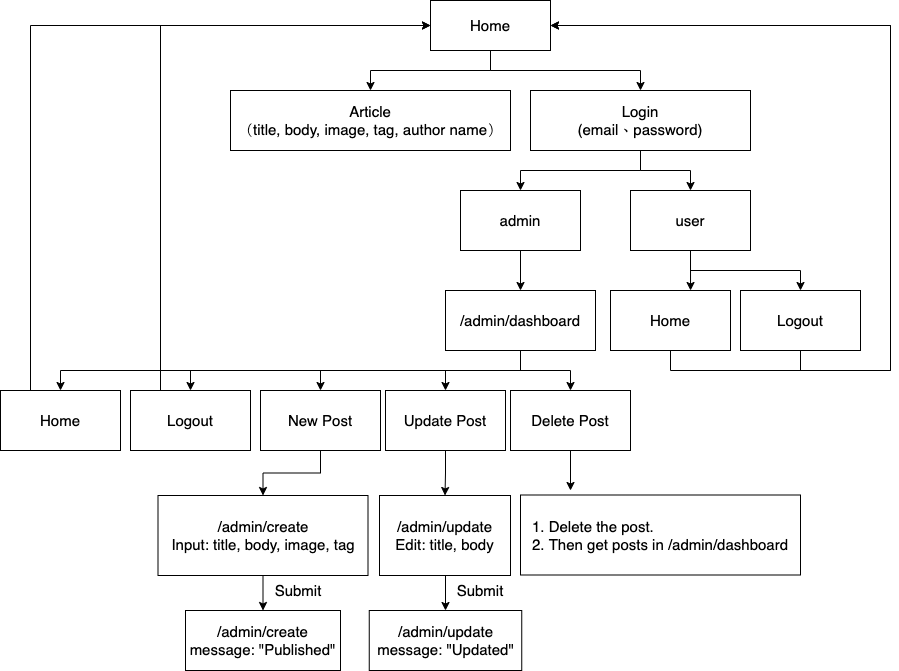

## About laravel_vue_cms website

這是一個文章發布的後台管理網站，可以登入管理者(Admin)帳號進行文章的新增、修改、刪除，並於前台顯示文章內容。
於後台新增文章時，可填入文章標題、內文、上傳圖片，及註明標籤。

### 功能
- 網站後台管理系統 ( Content Management System, CMS ):
    - 設有使用者權限判別，若登入為管理者身份(Admin)，便能進入後台介面，快速新增、編輯、刪除文章發布內容。
    - 新增文章：預設有「title」（文章標題）、「body」（內文）、「image」（上傳圖片）及「tag」（分類標籤）的管理者輸入欄位。
    - 編輯文章：管理者能編輯已發布之文章的「title」（文章標題）、「body」（內文）欄位。
    - 刪除文章：管理者能一鍵刪除特定文章的整筆資料。
- 前台頁面：
    - 供一般使用者身份(user) 讀取此網站上已發布的文章內容。
    - 每篇文章能顯示分類標籤(tag)。
- 使用單頁應用程式 ( Single Page Web Application,SPA )，能快速回應使用者請求：
    - 使用 SPA 能夠在第一次連結網站時，網站內容就已經被下載完成，所有資源不需要重新載入。
    - 使用者不需要重新整理頁面，頁面顯示流暢。在網頁瀏覽器中執行大部分的使用者介面邏輯，並主要使用 web Api 與 web 伺服器通訊。
    - 不同於傳統網頁之處：以前製作網站大多是在點選一個按鈕後，重新載入另外一個頁面，會有多個頁面切換。而 SPA 則是能夠把所有資料都放在同一個頁面，不需要換頁，使用者可以在單一頁面裡瀏覽全部內容。

### 操作說明：

關於使用管理者身份(Admin)，登入後台管理介面，進行文章相關功能操作：
此專案預設有 ```./database/seeders/UserTableSeeder.php```，user 資料表的資料填充有 2 位使用者--'Samuel Jackson'(一般使用者，user_id = 1)及'White Noise'（管理者，user_id = 2）。
故於首頁登入(login)時，請嘗試輸入```email = 'cantbackdown86@gmail.com'```，```password = 'white1234'```，便能以管理者身份登入後台管理介面。
若以```email = 'samueljackson@jackson.com'```，```password = 'samuel1234'```登入，則將被判斷為一般使用者，無法進入後台管理介面，僅能於前台閱讀文章。

```UserTableSeeder```檔案內容節錄如下：

```bash
<?php
...
class UserTableSeeder extends Seeder
{
    public function run()
    {
        $user = new User;
        $user->name = 'Samuel Jackson';
        $user->email = 'samueljackson@jackson.com';
        $user->password = bcrypt('samuel1234');
        $user->save();
        $user->roles()->attach(Role::where('name', 'user')->first());

        $admin = new User;
        $admin->name = 'White Noise';
        $admin->email = 'cantbackdown86@gmail.com';
        $admin->password = bcrypt('white1234');
        $admin->save();
        $admin->roles()->attach(Role::where('name', 'admin')->first());
    }
}
```

### 開發環境

- 語言：PHP ^8.0.0
- 框架：Laravel ^8.18.1, Vue.js ^2.6.12
- 資料庫：MySQL
- 資料庫管理工具：phpMyAdmin
- 套件 - 標籤套件: rtconner/laravel-tagging ^4.0

### 網站架構


### 過程中遇到的問題與除錯(debug)

#### 1. 使用者權限設定

在專案目錄下，輸入以下指令：
```bash
$ php artisan make:auth
```
出現錯誤訊息:

```bash
Command "make:auth" is not defined.
```

解決辦法:
因為laravel改版後，不能使用原本的 "make:auth" 指令，所以可以改用 Composer 安裝 Laravel UI 套件:

```bash
$ composer require laravel/ui
```
生成 auth scaffolding：

請使用 ui 的指令，並且加入--auth 這個參數：

```bash
$ php artisan ui vue --auth
```

顯示結果如下，能夠成功生成 Authentication scaffolding 了。

```bash
Vue scaffolding installed successfully.
Please run "npm install && npm run dev" to compile your fresh scaffolding.
Authentication scaffolding generated successfully.
```

#### 2. 首頁（前台）顯示單一篇文章時出錯
原本按照 [neoighodaro/laravel-vue-cms tutorial](https://github.com/neoighodaro/laravel-vue-cms) 教學，在 ```routes/web.php``` 設定「顯示單一篇文章」的路由如下：

```bash
Route::get('/posts/{post}', 'PostController@single');
```

但執行```$ php artisan serve```指令啟動一個內建伺服器後，瀏覽器沒出現畫面。找到原因，一樣因為 laravel 版本更新後，程式碼寫法不同。
Laravel ^ 8.x.x 可改成以下寫法：

```bash
Route::get('/posts/{post}', [PostController::class,'single']);
```

#### 3. 後台 post update 時出錯

原本按照 [neoighodaro/laravel-vue-cms tutorial](https://github.com/neoighodaro/laravel-vue-cms) 教學，在 ```./resources/views/landing.blade.php``` 模板中，為了讓文章顯示在首頁時，內文的部分可以限制字串長度，
所以使用 ```str_limit``` 如下：

```bash
{{-- File: ./resources/views/landing.blade.php --}}
...
<p class="card-text"> {{ str_limit($post->body, $limit = 280, $end = '...') }} </p>
...
```

但於瀏覽器測試時，後台管理介面 post update 時出錯。原因是 Laravel ^ 5.8 之後， str helpers 被移除。

解決辦法：
請將```str_limit```改寫為```\Illuminate\Support\Str::limit```，

```landing.blade.php```整體內容，可參考下方範例：

```bash
{{-- File: ./resources/views/landing.blade.php --}}
@extends('layouts.master')

@section('content')
    ...
                @foreach ($posts as $post)
                        ...
                        <div class="card-body">
                            ...
                            <p class="card-text"> {{ \Illuminate\Support\Str::limit($post->body, $limit = 280, $end = '...') }} </p>
                            ...
                        </div>
                        ...
                @endforeach
    ...
@endsection
```

#### 4. 想去除 auth 自動提供的 user register 功能

解決辦法：
請到```.\routes\web.php```，將```Auth::routes(['register' => false]);```修改為```Auth::routes(['register' => false]);```，便能去除 auth 自動提供的 user register 功能。


### DEMO

- [Demo 影片](https://www.youtube.com/watch?v=QhgHGaMmD1o)

### Reference:
- [neoighodaro/laravel-vue-cms tutorial](https://github.com/neoighodaro/laravel-vue-cms)
- [rtconner/laravel-tagging](https://github.com/rtconner/laravel-tagging)
- [tagging tutorial](https://www.nicesnippets.com/blog/laravel-tag-system-tutorial-example)
